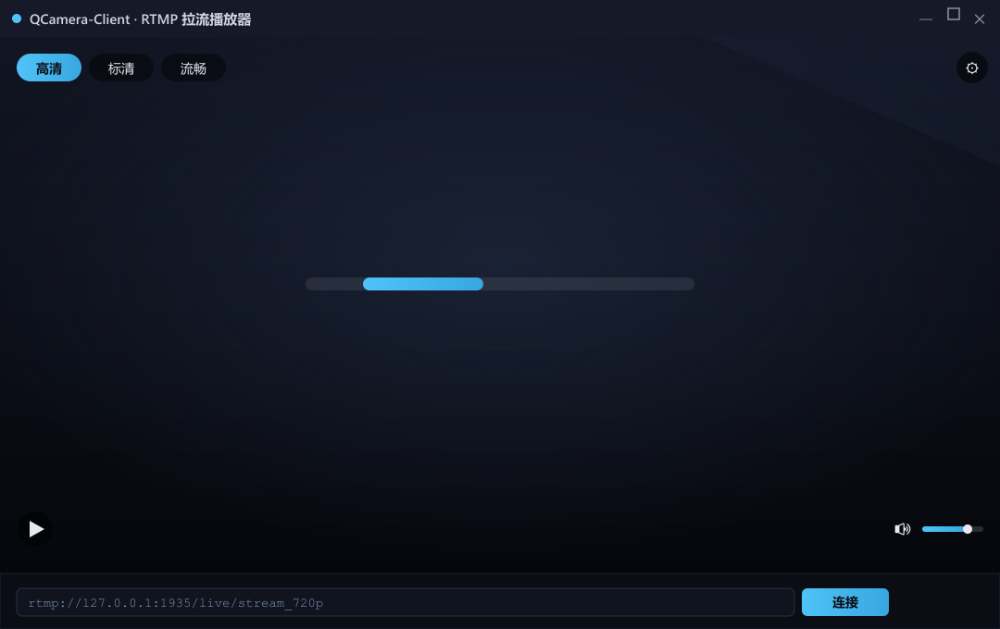

# QCamera-Client —— RTMP 拉流直播播放器

从 RTMP 服务器拉流，解封装、解码、音视频同步渲染的直播播放器，支持三档清晰度切换。

## 功能特性

- RTMP 拉流 → 解封装 → 解码 → 渲染
- 音视频同步（音频主时钟，落后丢帧 / 超前缓存）
- 清晰度切换（高清 / 标清 / 流畅三档）
- 断线自动重连（rw_timeout 读超时）
- 音量调节 + 静音
- 画面缩放三策略（等比 / 拉伸 / 裁剪）
- 暂停 / 全屏

## 界面预览



## 技术栈

- Qt 6（Widgets / Multimedia）
- FFmpeg（avformat / avcodec / swscale / swresample）
- C++17（智能指针 / 多线程 / 策略模式）

## 架构

```
RTMP 流 ─→ 解封装 ─┬─→ 视频解码 ─→ sws(YUV→RGB) ─→ 帧队列 ─→ 30ms 定时器 ─→ 渲染
                   └─→ 音频解码 ─→ swr(FLTP→S16) ─→ 音频队列 ─→ QAudioSink 播放
                                              ▲
                         音频主时钟（QAudioSink::processedUSecs）
```

## 目录结构

| 文件 | 职责 |
|------|------|
| avdeio.h/cpp | 拉流解码线程（解封装 + 音视频解码） |
| tqueue.h/cpp | 线程安全队列（视频/音频，QMutex + QWaitCondition） |
| audiosinke.h/cpp | 音频播放封装（QAudioSink） |
| videowidget.h/cpp | 画面渲染 |
| renderstrategy.h/cpp | 画面缩放策略（等比/拉伸/裁剪） |
| widget.h/cpp | UI + 音视频同步 + 控制 |
| logger.h/cpp | 分级日志 |

## 构建与运行

依赖：MSYS2 的 FFmpeg + Qt6 Multimedia，MSYS2 kit 编译。需先有推流端 QCamera 或任一路 RTMP 流。

```bash
# 1. 起 RTMP 服务器 + 推流端 QCamera
# 2. 编译运行 QCamera-Client，默认拉 720p
# 3. 点左上角「高清 / 标清 / 流畅」切换清晰度
```

## 设计亮点

1. **音频主时钟用「播放位置」，不是「帧到达时间」**
   最容易犯的错：拿最新解码帧的 pts 当时钟。但帧「到达」≠「已播放」，用到达时间当时钟会把时钟拨快，视频永远晚到被丢。用 `QAudioSink::processedUSecs`（声卡真实播到哪）当时钟，视频 pts 跟播放位置比才对得上。

2. **换流要「重锁时钟基准」**
   切清晰度/断线重连后，视频 pts 和播放位置都从头开始，旧基准会让视频 pts 超前、每帧都走缓存、帧率减半像慢放。换流时 `clockBasePts`/`procBace` 置 0 重新锁定。

3. **策略模式做画面缩放——开闭原则**
   等比/拉伸/裁剪三种缩放抽象成 `Renderstrategy` 基类 + 三个子类，VideoWidget 只认基类。加新缩放方式不改旧代码。

4. **断线重连的「最后一公里」**
   `rw_timeout` 设 3 秒（否则断流后 `av_read_frame` 卡 socket 几十秒）；重连用 `avformat_close_input` 关 socket（`free_context` 只清内存，连接还挂着）；断流后消费者阻塞 pop 卡死主线程，pop 前先 isEmpty 判空。

5. **生产者-消费者：单解码线程 + 双定时器**
   `Avdeio` 一个线程干完「拉流→解封装→音视频双路解码→入两队列」；主线程一个 30ms 定时器取视频帧上屏、一个 10ms 定时器取音频喂声卡。改解码器/参数只动 `Avdeio` 一处，队列用 QMutex + QWaitCondition 保线程安全。

6. **三态同步：落后丢帧 / 超前缓存 / 临界上屏**
   `streamstart()` 对视频帧分三档：`pts<audioClock-100000` → 丢帧（越拉越远）；`pts>audioClock+3000` → 存 pending 等下一周期（领先太多就等）；临界 → 直接上屏。音频未就绪的 `headpst` 期则丢视频帧防队列积压堵死解码线程——不搞一刀切，量不同程度分而治之。

## 踩坑记录

- 阻塞 pop 死锁——断流后消费者阻塞 pop 卡死主线程（界面假死），pop 前先 isEmpty 判空
- QImage 裸指针构造必须 copy() 再 free（引用不拥有内存）
- sws_getContext 要等首帧成功后建（那时才有宽高）
- 音频包 unref + return，别送视频解码器
- `rw_timeout` 不设 → 断流后 `av_read_frame` 卡死 socket 几十秒，画面定格还不重连，设 3s 才触发自动重连
- 切流/断线重连不清零时钟基准 → 视频 pts 领先播放位置，每帧都走缓存，帧率减半像慢放
- **排查别靠感觉猜**：我连猜错三次（open_input→等关键帧→find_stream_info），又误报「音频快 274ms」——其实是跨轮减时间戳翻车。要逐环节埋点、同一次运行内对比（见秒开章节）
- **「写入声卡 ≠ 已播放」**：别拿最新解码帧的 pts 当主时钟。但更要当心——`processedUSecs()`
  （Qt 文档写的是"已处理多少音频"）在 **Windows 后端实现的是 `totalInputBytes`，即"累计写进去多少"，
  不是"播到哪了"**。公开 API 里根本没有"播到哪了"这个量，要真播放位置只能自己减：
  `写入头 − (bufferSize − bytesFree) / 每秒字节数`
- 切清晰度要 `deio.reset()` + 重建线程，否则旧线程还连着旧 URL
- **队列满了"丢新"还是"丢老"，结果差很多**：原来 `push` 满了直接 `return`（扔掉**新**帧），
  等于**留着旧内容播、越播越落后**。直播的正确反应是**丢老帧、跳到直播边**——服务器开局会吐一坨
  gop_cache 旧料，那是"过去的直播"，该甩掉，不该用大队列养着
- **上屏定时器的粒度不能比帧间隔大**：`streamstart` 是"本 tick 只存一帧、下一 tick 才上屏"，
  **一帧要吃 2 个 tick**。定时器 30ms → 一帧 60ms → **30fps 的流只能上屏 16fps**（常态丢一半帧）。
  把 `setInterval(30)` 改成 **5**，一帧 10ms ≪ 33ms，立刻跑满 30fps
- **队列容量 = 延迟，不是"越多越稳"**：为了一次不丢音频，把音频队列从 10 块加到 40 块，
  音频延迟从 ~200ms 涨到 ~663ms（**耳朵听得出来**）。声卡按实时消耗、数据按实时到达，
  **队列里积压多少，就永久延迟多少**
- **别拿"不同基准的量"相减**：我拿音频轴的时钟去减视频轴的 pts，据此连编了三个错理论
  （帧过期被丢 / 推流端时间戳偏移 / 窗口拧大也能通），**全被实测打回**。
  相减之前先问一句：**这两个数，是同一个零点吗？**

## 待优化

- 内存泄漏排查（Dr.Memory / valgrind）

---

## RTMP 秒开（首帧延迟）实测与优化

> 目标：点「连接」到屏幕出第一帧的耗时。逐环节埋点实测后，真凶锁定 `avformat_find_stream_info`。

### 各环节实测耗时（本地 RTMP 流）

| 环节 | 耗时 |
|------|------|
| `avformat_open_input` | ~4ms |
| `avformat_find_stream_info` | **~194ms（大头）** |
| 视频首帧解码 + sws + 入队 | ~6ms |
| 音频首帧解码 + swr + 写声卡 | ~1ms |
| 同步判断 + 上屏 | ~0（`headpst` 早已就绪） |

**第一帧真正响应用了约 198ms，其中 `find_stream_info` 占到 ~194ms，其余环节合计 <10ms。**

### 优化尝试与结果

| 手段 | 效果 |
|------|------|
| `analyzeduration=50000`（压分析预算） | ✅ 从 ~4s 降到 ~190ms，立竿见影 |
| `probesize=1024`（压嗅探字节） | ❌ 无效，属 RTMP 协议硬开销，压不动 |

### 一路排除的「非真凶」

- 不是**等关键帧**：`gop_cache` 生效，视频首帧解码 +6ms 就出
- 不是**被「等音频」扣住**：无音频时视频不吃亏，`headpst` 早就置位
- 不是**互斥锁**：视频走同一队列，~1ms 就出
- 不是**`byteFree` 门**：初始 35280 满，门根本没堵
- 不是**解码 / 渲染慢**：1~6ms 打完

### 结论

RTMP 场景下 `find_stream_info` 的 ~190ms 已接近下限，`analyzeduration` / `probesize` 都压不动。**想再快，得换思路**：客户端预连接、首帧前直接拉关键帧、硬解加速，或接受这一延迟。优化到此已近极限。

### 踩坑：音视频到达顺序不稳定

实测发现 RTMP 包里的音视频到达顺序**每次连接都不同**（有时音频先、有时视频先）。**不要用单次观测下「谁快谁慢」的结论**，必须用同一时间戳（`QDateTime::currentMSecsSinceEpoch()`）在单次运行内对比。跨轮比较时间戳，正是本次排查反复翻车的主因。
